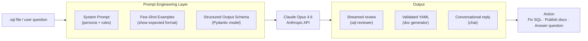
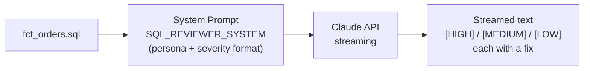
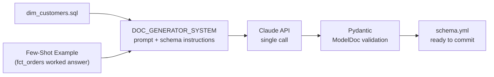
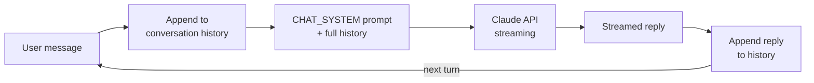

# AI Data Assistant

> A command-line AI assistant for data engineers. Point it at a SQL file to get an instant code review, generate dbt documentation without writing YAML by hand, or ask it data engineering questions in a persistent chat session.

**When you'd use this:**
- You've written a new dbt model and want a second opinion before committing
- You need to document a SQL model but don't want to write `schema.yml` from scratch
- You want a quick answer to a SQL, dbt, Snowflake, or Airflow question without leaving the terminal

Each feature is a self-contained example of a different AI engineering pattern — streaming, few-shot prompting, and structured output validation — built directly on the Anthropic API with no framework abstraction in between.




### Core AI engineering skills demonstrated

| Skill | How it's shown |
|-------|----------------|
| LLM API integration | Anthropic Python SDK — streaming, single calls, multi-turn |
| Prompt engineering | System prompts, few-shot examples, structured outputs |
| Output validation | Pydantic v2 — guaranteed schema compliance, no string parsing |
| Agentic patterns | Stateful multi-turn chat with full conversation history |

### Why not LangChain?

LangChain is a popular abstraction layer for chaining LLM calls, but for focused use cases like this it adds complexity without much benefit. This project uses the **Anthropic SDK directly** — giving full visibility into every API call, prompt, and response. That's intentional: understanding what's happening at the SDK level is the foundation before layering on frameworks like LangChain or LlamaIndex. Both are worth knowing; the raw SDK is where to start.

---

## What it does

A command-line tool for data engineers with three AI-powered features.

---

### 1. `review` — SQL code reviewer

Takes any `.sql` file and streams a code review flagging performance issues, correctness bugs, dbt convention violations, and style problems — each with a severity and a concrete fix.



```bash
python main.py review examples/fct_orders.sql
```

**Input** (`examples/fct_orders.sql`):
```sql
select
    o.order_id,
    o.customer_id,
    o.created_at,
    o.status,
    sum(i.quantity * i.unit_price) as revenue,
    count(*) as line_items,
    c.country,
    c.plan_type
from orders o
join order_items i on o.order_id = i.order_id
join customers c on o.customer_id = c.customer_id
where o.status != 'cancelled'
group by 1, 2, 3, 4, 7, 8
```

**Output:**
```
[HIGH] Raw table names bypass the dbt DAG — orders, order_items, customers should use
  ref() macros so dbt can build the dependency graph correctly.
  Fix: replace `from orders` with `from {{ ref('stg_orders') }}`

[MEDIUM] Positional GROUP BY (1, 2, 3...) breaks silently if columns are reordered.
  Fix: name each column explicitly — GROUP BY o.order_id, o.customer_id, ...

[LOW] != 'cancelled' excludes NULL status rows, which may be unintentional.
  Fix: WHERE status NOT IN ('cancelled') OR status IS NULL
```

---

### 2. `docs` — dbt documentation generator

Takes a SQL model and generates a ready-to-use `schema.yml` file with column descriptions and recommended dbt tests. Uses few-shot prompting to enforce consistent output format, and Pydantic to validate the result before printing.



```bash
python main.py docs examples/dim_customers.sql --model dim_customers
```

**Input** (`examples/dim_customers.sql`):
```sql
with source as (
    select * from {{ source('app_db', 'customers') }}
),
cleaned as (
    select
        customer_id,
        lower(trim(email))              as email,
        coalesce(first_name, 'Unknown') as first_name,
        last_name,
        country_code,
        plan_type,
        created_at,
        updated_at,
        case when deleted_at is not null then true else false end as is_deleted
    from source
    where customer_id is not null
)
select * from cleaned
```

**Output:**
```yaml
version: 2

models:
  - name: dim_customers
    description: One row per customer with cleaned and normalised contact fields.
    columns:
      - name: customer_id
        description: Unique identifier for each customer.
        tests:
          - unique
          - not_null
      - name: email
        description: Lowercased and trimmed customer email address.
      - name: first_name
        description: Customer first name, defaulting to 'Unknown' when null.
      - name: country_code
        description: ISO country code for the customer.
      - name: plan_type
        description: Subscription plan the customer is on.
      - name: is_deleted
        description: True if the customer record has been soft-deleted.
```

---

### 3. `chat` — interactive data engineering assistant

A multi-turn conversational assistant with full conversation history. Ask anything about SQL, dbt, Snowflake, Airflow, or Prefect — it remembers context across turns.



```bash
python main.py chat
```

**Example session:**
```
You: what's the difference between a dbt source and a ref?
Assistant: source() points to raw tables outside your dbt project — usually your
           landing zone or ingestion layer. ref() points to models inside your
           project and is how dbt builds the DAG. Rule of thumb: if you didn't
           write the SQL for it, use source().

You: so where should I put source definitions?

Assistant: In a sources.yml file inside the models/ directory of the relevant
           domain — e.g. models/staging/sources.yml. One sources.yml per schema
           keeps things easy to find.
```

---

## Prompt engineering techniques

### 1. System prompts (`src/prompts.py`)
Each feature has a tailored system prompt that gives the model a persona and explicit output rules.

```python
SQL_REVIEWER_SYSTEM = """You are a senior data engineer specializing in SQL best practices...
Format your feedback as numbered issues with severity [HIGH / MEDIUM / LOW]..."""
```

### 2. Few-shot examples (`src/doc_generator.py`)
Before the real SQL is sent, the model sees a worked example of exactly the output format we want.
This dramatically reduces hallucinations and format drift.

```python
messages = [
    *FEW_SHOT_DOC_EXAMPLES,   # show Claude what 'good' looks like first
    {"role": "user", "content": f"Generate docs for:\n{sql}"},
]
```

### 3. Structured outputs (`src/doc_generator.py`)
Using `client.messages.parse()` with a Pydantic model guarantees the response matches our schema.

```python
class ModelDoc(BaseModel):
    model_name: str
    description: str
    columns: list[ColumnDoc]
    yaml_output: str

response = client.messages.parse(..., output_format=ModelDoc)
doc: ModelDoc = response.parsed_output  # fully validated
```

---

## Setup

See [SETUP.md](./SETUP.md) for full instructions including the Ollama (open source) option.

```bash
git clone https://github.com/ohderek/ai-engineering-portfolio
cd ai-engineering-portfolio/ai-data-assistant
pip install -r requirements.txt
cp .env.example .env  # add your ANTHROPIC_API_KEY
```

---

## Stack

- **LLM**: Claude Opus 4.6 via [Anthropic Python SDK](https://github.com/anthropics/anthropic-sdk-python)
- **CLI**: [Typer](https://typer.tiangolo.com/)
- **Validation**: [Pydantic v2](https://docs.pydantic.dev/)
- **Terminal UI**: [Rich](https://rich.readthedocs.io/)

---

## Resources

- [Anthropic API docs](https://platform.claude.com/docs)
- [Prompt engineering guide](https://platform.claude.com/docs/en/build-with-claude/prompt-engineering/overview)
- [dbt best practices](https://docs.getdbt.com/best-practices)
- [LangChain docs](https://python.langchain.com/docs/introduction/) — framework for chaining LLM calls
- [LlamaIndex docs](https://docs.llamaindex.ai/) — framework for RAG and document retrieval
