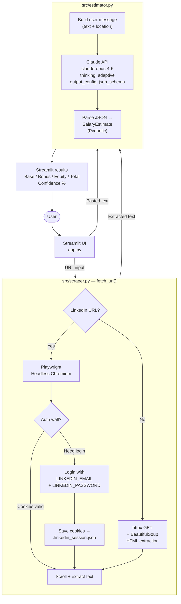
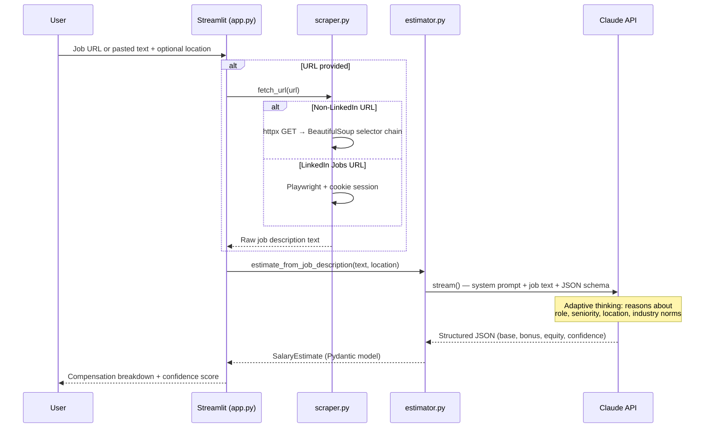
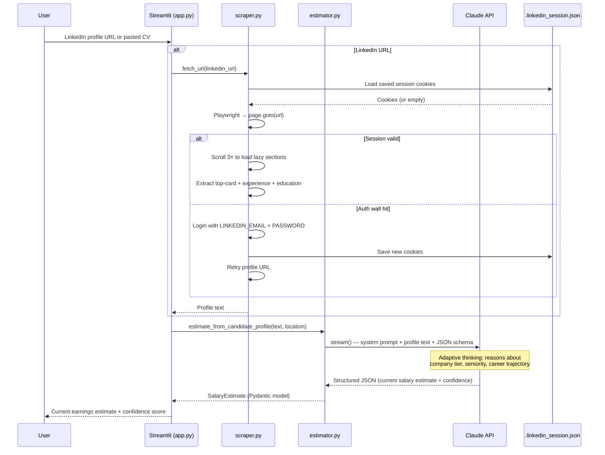

# Salary Estimator

> A hypothetical compensation intelligence tool that estimates salary ranges for job postings and candidate profiles using Claude AI. Accepts URLs or pasted text and returns structured estimates with confidence scores.

**When you'd use this:**
- As a **job seeker** — paste a job description or URL to understand the likely compensation before applying or negotiating
- As a **recruiter** — paste a candidate's LinkedIn profile or CV to estimate their current earnings before making an offer

---

## Features

- Paste a job posting URL (Greenhouse, Lever, Workday, Indeed, LinkedIn Jobs, most company career pages) or the raw text
- Paste a LinkedIn profile URL or any CV/employment history text
- Location auto-detected from the content, or enter it manually
- Returns base salary, bonus, equity, and total comp as ranges
- Confidence score (0–100%) with rationale explaining data availability
- Powered by Claude Opus 4.6 with adaptive thinking and structured JSON output

---

## Architecture



---

## Data flows

### Mode 1 — Job Description (job seeker)



### Mode 2 — Candidate Profile (recruiter)



### Structured output schema

Claude is constrained to return valid JSON matching this schema on every call:

```
SalaryEstimate
├── role_title          str      "Senior Data Engineer"
├── location            str      "Dublin, Ireland"
├── seniority_level     str      "Senior (IC4)"
├── currency            str      "EUR"
├── base_salary         {low, high}        e.g. {70000, 85000}
├── annual_bonus        {low, high} | null e.g. {7000, 12000}
├── bonus_note          str | null "10-15% of base, performance-linked"
├── equity_note         str | null "RSUs $20k-40k/yr (public co)"
├── total_compensation  {low, high}        e.g. {77000, 97000}
├── confidence_pct      int        85
├── confidence_rationale str       "High data availability for senior..."
├── key_factors         [str]      ["5+ years experience", "Dublin market..."]
└── caveats             [str]      ["Equity varies by company stage"]
```

---

## AI engineering concepts demonstrated

| Concept | Implementation |
|---|---|
| **Structured outputs** | `output_config: {format: json_schema}` constrains Claude to return valid JSON every call |
| **Adaptive thinking** | `thinking: {type: "adaptive"}` — Claude reasons about market data before answering |
| **Streaming** | `client.messages.stream()` with `.get_final_message()` avoids HTTP timeouts on long responses |
| **Web scraping** | `httpx` + `BeautifulSoup` for public job boards; selector cascade handles multiple board formats |
| **Browser automation** | Playwright with cookie persistence for auth-walled pages (LinkedIn) |
| **Pydantic validation** | Response JSON is validated against `SalaryEstimate` model before rendering |

---

## Setup

### 1. Create virtual environment

```bash
cd salary-estimator
python3 -m venv .venv
source .venv/bin/activate
```

### 2. Install dependencies

```bash
pip install -r requirements.txt
playwright install chromium      # one-time browser download (~120MB)
```

### 3. Configure environment

```bash
cp .env.example .env
```

Edit `.env`:

```env
ANTHROPIC_API_KEY=sk-ant-...

# Only required for LinkedIn URL scraping
LINKEDIN_EMAIL=you@example.com
LINKEDIN_PASSWORD=your-password
```

### 4. Run

```bash
streamlit run app.py
```

Open **http://localhost:8501**

---

## Usage

### Job Description tab

| Input | What to provide |
|---|---|
| URL | Any public job posting — Greenhouse, Lever, Workday, Ashby, Indeed, LinkedIn Jobs, company career pages |
| Text | Paste the full JD if you don't have a URL |
| Location | Leave blank to auto-detect from the content, or override (e.g. `London, UK`) |

### Candidate Profile tab

| Input | What to provide |
|---|---|
| URL | A LinkedIn profile URL (`linkedin.com/in/...`) |
| Text | Paste LinkedIn profile text, CV, or any employment history |
| Location | Leave blank to auto-detect, or override |

---

## LinkedIn session

On first use of a LinkedIn URL, the scraper will:

1. Launch headless Chromium and navigate to the URL
2. Detect the auth wall and log in using `LINKEDIN_EMAIL` + `LINKEDIN_PASSWORD`
3. Save the session cookies to `.linkedin_session.json`
4. All subsequent requests reuse the cookie — no re-login until the session expires

`.linkedin_session.json` is excluded from git via `.gitignore`.

---

## Confidence scores

| Score | Label | Meaning |
|---|---|---|
| 85–95% | 🟢 High | Common role type in a major market with abundant public data |
| 65–84% | 🟡 Medium | Some ambiguity in level, smaller market, or moderate data availability |
| 40–64% | 🔴 Low | Highly specialised role, unusual location, or sparse comparable data |

---

## Stack

| Layer | Tool |
|---|---|
| UI | Streamlit |
| LLM | Claude Opus 4.6 (`claude-opus-4-6`) via Anthropic Python SDK |
| Structured output | `output_config: json_schema` + Pydantic v2 |
| Job scraping | `httpx` + `BeautifulSoup4` |
| LinkedIn scraping | Playwright (headless Chromium) |
| Config | `python-dotenv` |
