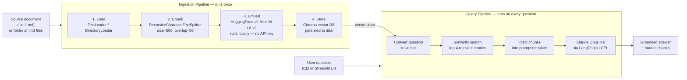

# Support RAG Bot

> A Retrieval-Augmented Generation (RAG) pipeline that turns any business document into a queryable support bot. Point it at a product FAQ, HR policy, or operations manual and ask questions in plain English.

**When you'd use this:**
- Your support team is answering the same FAQ questions repeatedly — automate first-line responses
- You have a large policy or onboarding document and need staff to find answers quickly
- You want to give customers self-serve answers grounded in your actual documentation, not hallucinated responses

---

## How it works



---

## AI engineering concepts demonstrated

| Concept | What it does | Where |
|---------|-------------|-------|
| **Document chunking** | Splits long documents into overlapping segments so the LLM only sees relevant context | `src/ingest.py` |
| **Embeddings** | Converts text to vectors using a local HuggingFace model — no API key needed | `src/ingest.py` |
| **Vector store (Chroma)** | Persists vectors to disk; finds semantically similar chunks via cosine similarity | `src/ingest.py` |
| **RAG** | Retrieves relevant chunks before calling the LLM, grounding answers in real content | `src/chain.py` |
| **LangChain LCEL** | Chains retriever → prompt → LLM → parser with the `\|` operator | `src/chain.py` |
| **Prompt template** | Constrains the LLM to answer only from retrieved context, reducing hallucination | `src/chain.py` |
| **Source citations** | Returns which chunks were used to produce the answer | `main.py` |

---

## Step-by-step: what happens under the hood

### Step 1 — Ingestion (`python main.py ingest`)

```
flowdesk_faq.txt  (2,800 words)
        │
        ▼  TextLoader
  1 document object
        │
        ▼  RecursiveCharacterTextSplitter (size=500, overlap=50)
  ~28 chunks
        │
        ▼  HuggingFaceEmbeddings (all-MiniLM-L6-v2)
  28 × 384-dimension vectors
        │
        ▼  Chroma.from_documents()
  ./vector_db  (persisted to disk)
```

**Why chunk?** LLMs have context limits. Sending the entire document with every question wastes tokens and cost. Chunking lets us send only the 3-4 most relevant paragraphs.

**Why overlap?** A sentence split across two chunks would be lost. 50 characters of overlap ensures continuity at boundaries.

**Why HuggingFace embeddings?** The embedding model runs locally — no API call, no cost, sub-second latency. The LLM (Claude) is only called at query time.

---

### Step 2 — Query (`python main.py ask` or `python main.py chat`)

```
"How do I cancel my subscription?"
        │
        ▼  same HuggingFace model converts question → vector
  [0.23, -0.14, 0.87, ...]  (384 dimensions)
        │
        ▼  Chroma similarity search (cosine distance, top k=4)
  chunk_8:  "Go to Settings > Billing > Cancel Plan..."
  chunk_9:  "Your workspace will retain Pro features until..."
  chunk_12: "We offer a full refund within 7 days..."
  chunk_3:  "FlowDesk offers three plans: Starter, Pro, Enterprise..."
        │
        ▼  Injected into PromptTemplate as {context}
  "Use only the context below to answer..."
        │
        ▼  Claude Opus 4.6 (LangChain LCEL chain)
  "To cancel, go to Settings > Billing > Cancel Plan.
   Your workspace keeps Pro features until the billing
   period ends, then reverts to Starter. Data is never
   deleted. Refunds are available within 7 days of the
   first charge if you contact billing@flowdesk.io."
```

---

## Setup

### 1. Create a virtual environment

```bash
cd support-rag-bot
python3 -m venv .venv
source .venv/bin/activate
```

### 2. Install dependencies

```bash
pip install -r requirements.txt
```

> The first install downloads the HuggingFace embedding model (~90MB). Subsequent runs use the cached model.

### 3. Add your API key

```bash
cp .env.example .env
# open .env and set: ANTHROPIC_API_KEY=sk-ant-...
```

### 4. Ingest the sample document

```bash
python main.py ingest data/flowdesk_faq.txt
```

Output:
```
Loading: flowdesk_faq.txt
  Loaded 1 document(s)
  Split into 28 chunks (size=500, overlap=50)
  Embedding with all-MiniLM-L6-v2 (runs locally)...
  Stored 28 vectors → ./vector_db

Ingestion complete. You can now run: python main.py ask "your question"
```

### 5. Ask a question

```bash
python main.py ask "How do I invite someone to my workspace?"
```

### 6. See which chunks were used

```bash
python main.py ask "What is the refund policy?" --sources
```

### 7. Start an interactive session

```bash
python main.py chat
```

---

## Example questions to try

```bash
python main.py ask "How do I cancel my subscription?"
python main.py ask "What's the difference between the Pro and Enterprise plans?"
python main.py ask "How do I set up Slack notifications?"
python main.py ask "Where is my data stored?"
python main.py ask "Can I assign a task to more than one person?"
python main.py ask "What happens to my data if I delete my workspace?"
```

---

## Using your own documents

The bot works with any `.txt` or `.md` file, or a folder of `.md` files:

```bash
# Single file
python main.py ingest path/to/your_document.txt

# Folder of markdown files (recursive — picks up all .md files)
python main.py ingest path/to/docs/

# Absolute path outside the project
python main.py ingest /Users/you/notion-export/

python main.py ask "your question"
```

Re-running `ingest` replaces the existing vector store.

---

## Streamlit UI

A browser-based chat interface is available alongside the CLI:

```bash
streamlit run app.py
```

Open **http://localhost:8501**

- Sidebar: enter a file or folder path and click **Ingest**
- Chat input at the bottom for questions
- Toggle **Show source chunks** to see which document sections were used
- Auto-detects an existing vector store on startup (no need to re-ingest)

---

## Stack

| Layer | Tool | Notes |
|-------|------|-------|
| Orchestration | [LangChain](https://python.langchain.com/) | LCEL chain, retriever, prompt template |
| LLM | Claude Opus 4.6 via `langchain-anthropic` | Called only at query time |
| Embeddings | `all-MiniLM-L6-v2` via `langchain-huggingface` | Runs locally, no API key needed |
| Vector store | [Chroma](https://www.trychroma.com/) | Local, open source, persisted to disk |
| CLI | [Typer](https://typer.tiangolo.com/) | |
| Terminal UI | [Rich](https://rich.readthedocs.io/) | |
| Web UI | [Streamlit](https://streamlit.io/) | `streamlit run app.py` |
